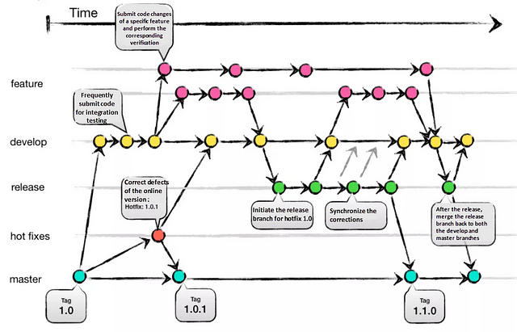
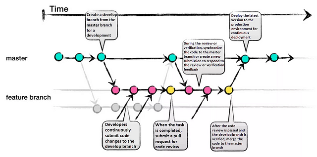
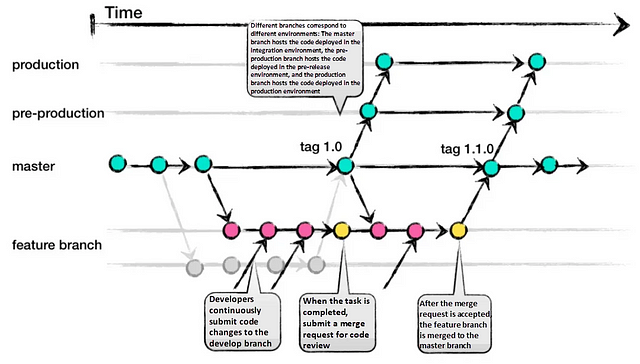
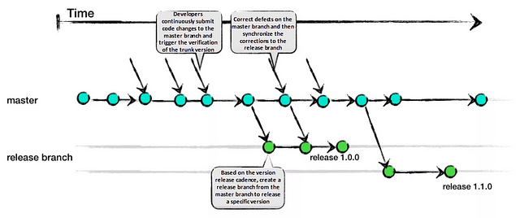

# Semantic Versioning

## Semantic Versioning

### Qu'est-ce que c'est ?

C'est un schéma de version constitué de trois parties numériques `Major.Minor.Patch`, par exemple `1.0.2`.

On peut y apposer une balise de pré-version facultative et une balise méta de construction facultative, par exemple `2.4.1-beta`.

## Semantic Versioning: Règles

### Comment ça fonctionne ?{.example}

- Quand une release contient **des modifications radicales** (non rétrocompatibles), on augmente la Major.
- Quand une release contient **des fonctionnalités**, on augmente la Minor.
- Quand une release ne contient **que des corrections**, on augmente le Patch.

# Conventional Commits

## Conventional Commits

### Qu'est-ce que c'est ?

C'est une convention qui fournit un ensemble de règles simples pour **créer un historique de commits explicite**.

Ceci permet une utilisation d'outils automatisés pour la génération de **notes de version**.

Cette convention s'accorde avec **SemVer**, en décrivant les fonctionnalités (features), les correctifs (fixes) et les modifications radicales (breaking changes) apportées aux messages de validation.

## Conventional Commits: Format et exemple

```
<type>[optional scope]: <description>

[optional body]

[optional footer(s)]
```

```
feat(osm): create endpoint for poi updates

Data is taken from OpenStreetMap and processed
by the API

BREAKING CHANGE: the new endpoint uses GeoJSON
```

## Conventional Commits: Les types fréquents

| Type                   | Description                              |
| ---------------------- | ---------------------------------------- |
| `feat`                 | Ajout de fonctionnalités                 |
| `fix`                  | Correction de bugs                       |
| `chore`                | Changements insignifiants                |
| `refactor`             | Cleanup code                             |
| `build`                | Changements sur la compilation du projet |
| `ci`                   | Continuous Integration                   |
| `style`                | Changements CSS uniquement               |
| `docs`, `perf`, `test` | Documentation, performance et test       |

## Conventional Commits

\centering\Large

> Spécifications complètes disponibles sur le site
>
> [conventionalcommits.org](https://www.conventionalcommits.org/)

# Code Formatting

## Code Formatting

### Qu'est-ce que c'est ?

C'est un ensemble de règles ou de lignes directrices utilisées lors de l'écriture du code source d'un programme informatique.

Généralement, on utilise des outils pour formater le code automatiquement en respectant ces règles.

## Code Formatting: Règles

### Éléments à configurer

- Indentation: tabulations vs 4 espaces vs 2 espaces
- Les sauts de lignes après ou avant les accolades `{`
- Les espaces autour des caractères spéciaux (accolades `{}`, parenthèses `()`, etc.)
- Longueur des lignes: 80 caractères vs 100 caractères vs 120 caractères

## Code Formatting: Comment formater ?

### Outils disponibles

- Prettier:
  - Supporte: `JavaScript`, `TypeScript`, `JSX`, `JSON`, `CSS`, `HTML`...
  - Disponible en plugin pour: VSCode, Atom, WebStorm, CLI (node)...
- IDE (IntelliJ, Eclipse...):
  - Configuration par langage en local à la main
  - Configuration par le support de [EditorConfig](https://editorconfig.org/) ou similaire pour le projet

## Code Formatting: Bonnes pratiques{.standout}

\centering\Large
Faut-il personnaliser le style ?

# Git Workflows

## Git Workflows

### Qu'est-ce que c'est ?

- Il existe plusieurs manières de gérer sa façon de travailler en équipe avec Git.
- On se base généralement sur une que nous devons par la suite suivre tout au long du projet.
- Elles ont toutes leurs avantages et inconvénients, mais ils dépendendent régulièrement des tailles des équipes ou du projet.

## Git Workflows: Git Flow



## Git Workflows: GitHub Flow



## Git Workflows: GitLab Flow



## Git Workflows: Trunk based Flow



## Git Workflows: One Flow

\begin{center}
\begin{minipage}{0.4\textwidth}
\centering \includegraphics[keepaspectratio]{./best-practices-images/oneflow-1.png}
One Flow 1
\end{minipage}~
\begin{minipage}{0.4\textwidth}
\centering \includegraphics[keepaspectratio]{./best-practices-images/oneflow-2.png}
One Flow 2
\end{minipage}
\begin{minipage}{0.4\textwidth}
\centering \includegraphics[keepaspectratio]{./best-practices-images/oneflow-3.png}
One Flow 3
\end{minipage}
\end{center}

## Git Workflows

### Nommage et points communs

- Nommez vos branche de feature/fix correctement (ex. `feat/joxit/add-map` ou `fix/firefox-v156`)
- Chque point de fusion des graphes sont soit des merges (branche visible), soit des squash (un seul commit)
