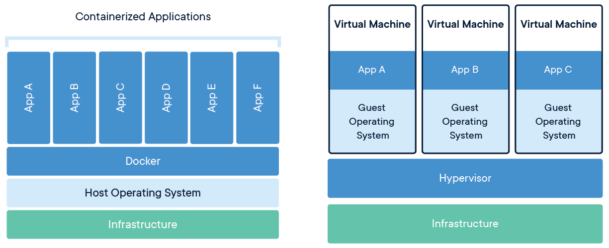
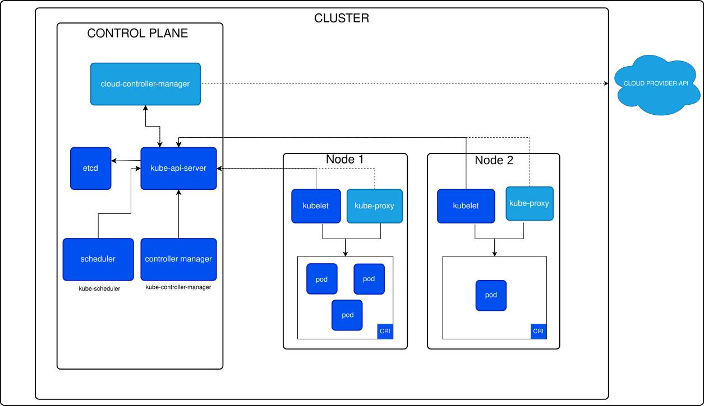

# Docker

---

## Docker

> Docker est un outil qui peut empaqueter une application et ses dépendances dans un container isolé, qui pourra être exécuté sur n'importe quel serveur - 451 Research

# Histoire de Docker

---

## Histoire de Docker

### Culture générale

- 2008: Création de la société française dotCloud par Solomon Hykes, Sébastien Pahl et Kamel Founadi (anciens d’Epitech)
- 2010: Présentation de leur projet interne "Docker" au Y Combinator et déménagement aux USA
- 2013: dotCloud devient Docker Inc.
- 2013: Première version de Docker
- 2015: Docker Inc valorisé à 1 Milliard de dollars

# Container vs Virtual Machine

---

## Container vs Virtual Machine



\pause

### Définitions

- Infrastructure = ordinateur / serveur
- Hypervisor: s'exécute soit sur l'infrastructure (type 1), soit via un logiciel dans un OS (type 2)
  - Type 1: KVM, Microsoft Hyper-V et VMware vSphere
  - Type 2: VMware Workstation et Oracle VirtualBox

## Container vs Virtual Machine

### Container{.example}

- Un container est léger:
  - Un seul OS sur l'infrastructure, les containers partagent le même kernel
  - Nécessite moins de ressources (RAM, CPU, Disk)
- Sécurisé, isolation des app par défaut (communication possible)
- Installation simple, tout est géré par Docker
- Un standard qui peut être implémenté par d'autres
- Livrable déployable partout

\pause

### Cas d'utilisation

- Des équipes de Dev/DevOPS pour leur application
- Déploiement sur des orchestrateurs (Kubernetes, Nomad, Rancher...)
- Disposer de plusieurs containers sur la même infrastructure ou dans des VM (Cloud)

## Container vs Virtual Machine

### Virtual Machine{.example}

- Une VM a un OS complet:
  - Plusieurs OS incompatibles peuvent aller sur la même infrastructure
  - Nécessite plus de ressources (RAM, CPU, Disk)
- Sécurisé, une VM est virtuellement une machine
- Pas de standard, installation complexe

\pause

### Cas d'utilisation

- Des Cloud Providers (Google Cloud, Amazon Web Services, OVH...)
  - Leur infrastructures sont des machines à 64 coeur ou plus
  - Ils vendent des VM de 1 coeur à 16 coeurs
- Un développeur avec un ordinateur Linux qui a besoin ponctuellement d'un Windows (et vice-versa)

# Comment ça fonctionne ?

## Notions

### Lexique

- Dockerfile: recette pour créer une image docker, elle se base 99% du temps sur une autre image existante
- Image: archive en lecture seule contenant votre application (`docker build -t image-name:tag .`)
  - Une image est identifiée par un identifiant ou son couple nom + tag (ex: `joxit/docker-registry-ui:2.5`)
- Container: instance d'une image en cours d'exécution, votre application est en route (`docker run -ti image-name:tag`)
  - Un container est identifié par un identifiant ou son nom
- Docker Registry: répertoire en ligne d'images accessibles et utilisables ([hub.docker.com](https://hub.docker.com) par défaut)

## Notions

### Autour de Docker

- Docker Engine: le coeur de docker que vous devez [_installer_](https://docs.docker.com/engine/install/)
  - Docker Serveur: démon qui run sur votre machine après l'installation
  - Docker Client: ligne de commande pour gérer votre serveur Docker de votre machine
- Docker Desktop: application de bureau pour Windows, Mac OS et Linux (freemium)
- Orchestrateur: outil supplémentaire pour gérer la vie de vos containers

## Images: Dockerfile

```dockerfile
# Image source disponible sur hub.docker.com
FROM eclipse-temurin:17-jre-alpine

# Dossier de travail quand on sera dans le container
WORKDIR /usr/src/osm

# On execute une commande qui sera dans l'image finale
RUN apt-get update && apt-get install curl

# On copie de l'ordinateur vers l'image
COPY build/libs/osm-boot.jar osm-boot.jar

# La commande exécutée quand le container démarre
CMD java $JAVA_OPTS -jar osm-boot.jar
```

## Images: les layers

### Qu'est-ce que des layers ?{.example}

- Chaque instruction génère un layer qui est mis en cache
- Lors d'une mise à jour du dockerfile, uniquement les instructions après la modification sont rejouées
- Une image recréée avec le même couple nom + tag écrase l'ancienne
- On peut optimiser la création d'images
  - Quand on a plusieurs applications qui ont besoin des mêmes dépendances, on peut créer une image de base
  - C'est une bonne pratique de supprimer ce qui n'est pas nécessaire dans l'image (ex. télécharger une archive, la décompresser puis la supprimer dans le même `RUN`)
  - Faire du multi stage build (à lire => https://blog.jawg.io/docker-multi-stage-build/)

## Images: les bonnes pratiques

### Bonnes pratiques

- Une image doit contenir une application seule
  - Mauvaise pratique d'avoir BDD + app dans le même container
- Elle ne doit pas contenir de clés privés, elles doivent être passées à l'exécution du container
- Elle doit pouvoir configurer son container si besoin
- Il faut éviter d'exposer l'utilisateur root (instruction `USER`)
- Il faut déclarer les ports utilisés

## Containers

### Qu'est-ce qu'un container ?{.example}

- C'est l'instance d'une image qui est en cours d'exécution
- Il doit survivre à un redémarrage
- Il peut être managé par différents outils
  - Le démon docker (`docker run`)
  - Docker Compose (`docker compose run`)
  - Un orchestrateur (Kubernetes, Nomad...)

## Containers

### Les fonctionnalités{.alert}

- Il est isolé de votre machine
  - Pas de communication entre processus direct
  - 127.0.0.1 et localhost correspondent au container (sauf si `--network=host`)
  - Pour communiquer avec un autre container il faut donner son nom et gérer les networks docker (`docker network`)
  - Pas d'accès au disque de la machine hôte (sauf si `--volume /path:/path`)
- Il peut être stoppé puis relancée et gardera son même état persistant (disque dur)
- Il peut être sauvegardé et transformé en image (`docker container commit`)
- Vous pouvez exposer des ports du container sur votre machine (attention à configurer les adresses d'écoute)

# Pour aller plus loin

## Orchestration des conteneurs

> L'orchestration des conteneurs consiste à automatiser le **déploiement** (configuration, démarrage...), la **gestion** (placement des containers, redémarrage, mise à jour...), la **mise à l'échelle** (réplication de containers) et la **mise en réseau** (communication entre containers) des conteneurs tout au long de leur **cycle de vie**.

## Les Orchestrateurs

### Quelles sont leurs tâches ?{.example}

- Le provisionnement et le déploiement
- La configuration et l'ordonnancement (quel container va sur quel node)
- L'allocation des ressources (CPU, RAM...)
- Accessibilité des conteneurs (network, contrôle d'accès)
- La mise à l'échelle (ajout/suppression)
- L'équilibrage de charge et le routage du trafic (entre nodes ou conteneurs)
- La surveillance de l'intégrité des conteneurs (toujours up)

## Les orchestrateurs

- **Apache Mesos** (UC Berkeley 2009, support docker v0.20.0+ 2014, Apache Foundation 2016) \includegraphics[keepaspectratio,height=12px]{./docker-images/mesos-logo.png}
- **Rancher** (Rancher Labs 2014, SUSE 2020) \includegraphics[keepaspectratio,height=12px]{./docker-images/rancher-logo.png}
- Docker Classic Swarm (Docker 2014-2018 \twemoji{skull})
- **Kubernetes** (Google 2014, Cloud Native Computing Fondation 2015) \includegraphics[keepaspectratio,height=12px]{./docker-images/kubernetes-logo.png}
- **Nomad** (Hashicorp 2015) \includegraphics[keepaspectratio,height=12px]{./docker-images/nomad-logo.png}
- Docker Compose (Docker 2015)
- Docker Swarm Mode (Docker + Moby Project 2016)

## Architecture: exemple Kubernetes



## Conclusion {.standout}

\centering\Huge Questions
