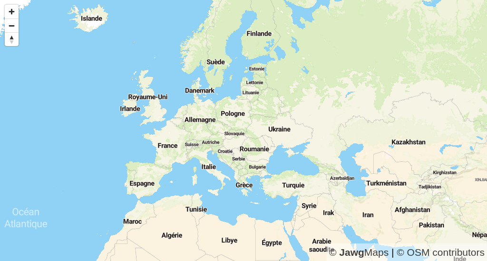
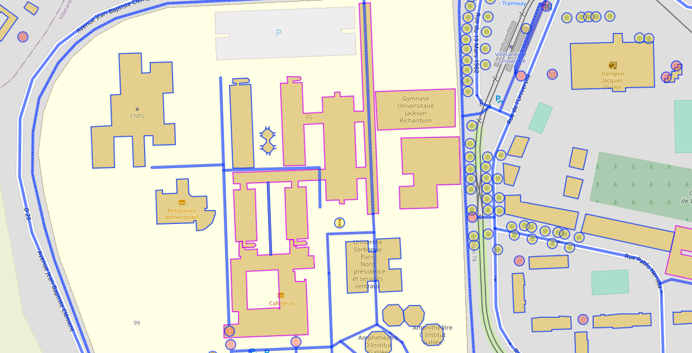
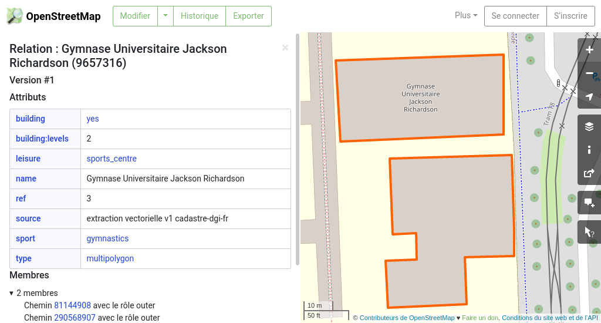
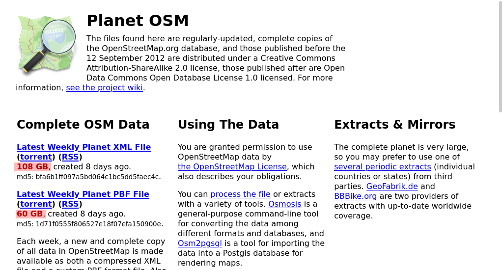
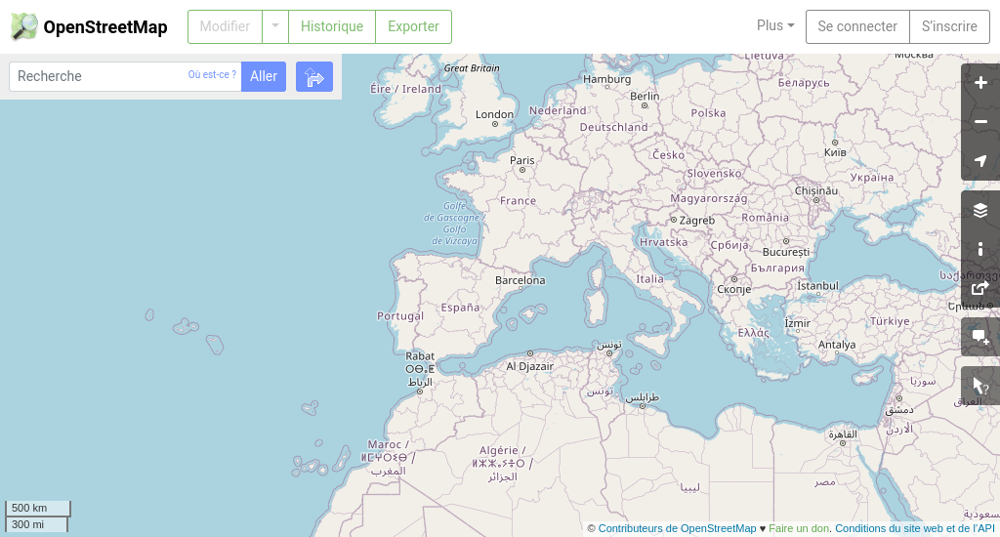
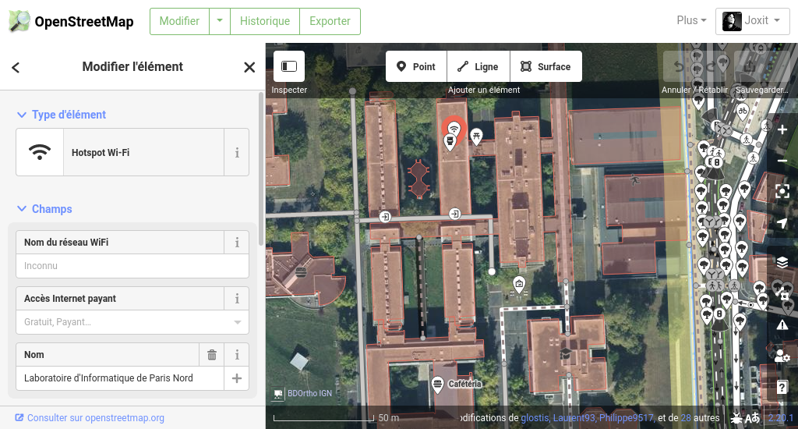
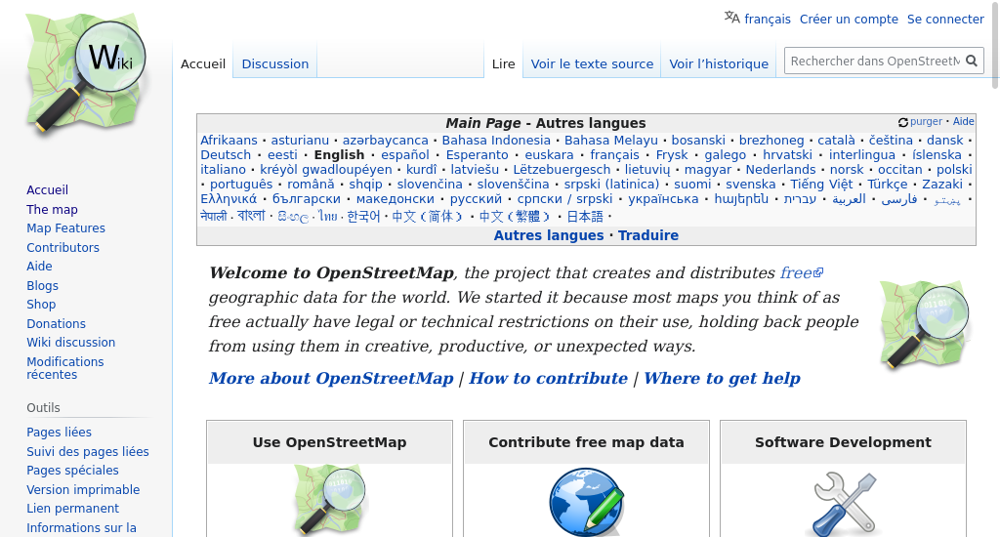
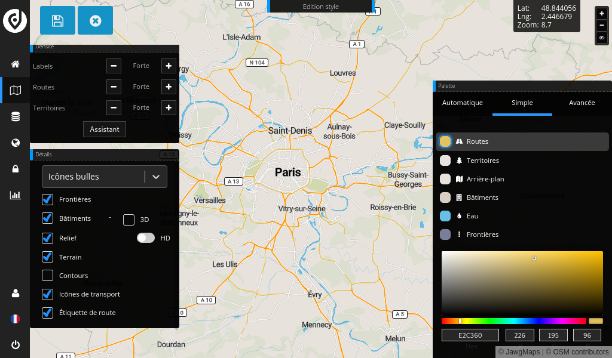
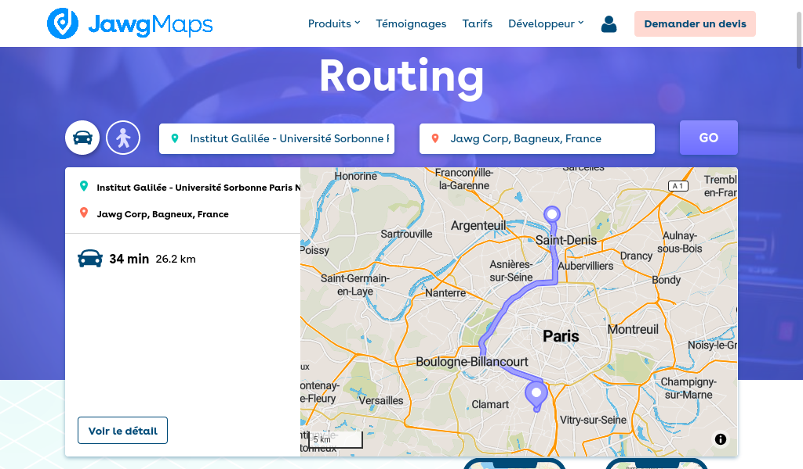
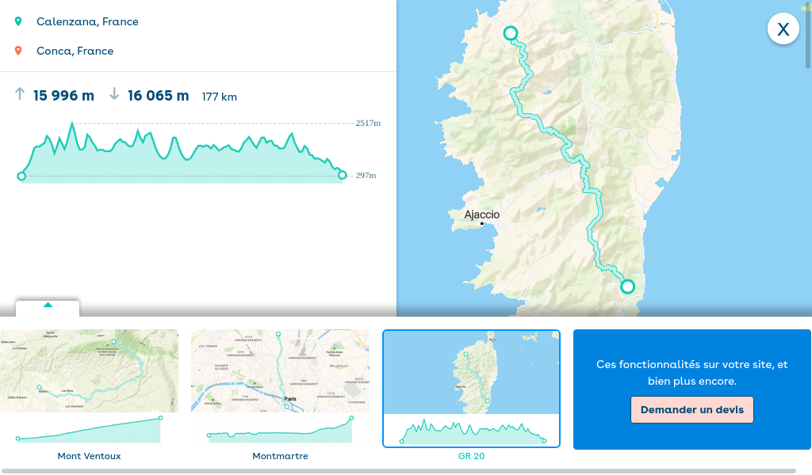

# OSM

---

## OpenStreetMap

> No one knows everything, everyone knows something, all knowledge resides in humanity...
- Pierre Levy

## Le projet OpenStreetMap

### Le projet OpenStreetMap
- Projet de cartographie mondial
- Fondé en 2004 en Angleterre
- Projet collaboratif
- Fondation à but non lucratif
- Chaque pays a sa communauté
- Organisation de State Of The Map (conférences modiales)

## La donnée OSM

\center\Large Projet de cartographie mondial

{ height=256px }

## La donnée OSM

\center\Large Types de données différents: Nodes, Way, Relations

{ height=256px }

## La donnée OSM

\center\Large Tags clé/valeur

{ height=300px }

## La donnée OSM

\center\large Parution hebdomadaire au format BZ2/PBF (100Go/60Go) avec mise à jour par minutes/heures/jours

{ height=300px }

## La donnée OSM

\center\Large Open Database License (ODbL)

- Possibilité d'utiliser la donnée publiquement et commercialement
- Obligation de maintenir la license sur la donnée après ajout/modification
- Obligation de mentionner à chauqe usage `© les contributeurs d’OpenStreetMap`

## La carte OSM

\center\Large Fond de carte par défaut: <https://osm.org>

{ height=300px }

## La carte OSM

\center\large Éditable via iD (osm.org), JOSM (desktop), OSM Contributors (Android), StreetComplete (Android)...

{ height=300px }

## La carte OSM

\center\Large Un wiki dédié: <https://wiki.osm.org/>

{ height=300px }

## Les providers OSM

### Les providers OSM {.example}
- **Jawg**Maps (France)
- Mapbox (USA)
- Carto (USA)
- Geofabrik (Allemagne)
- Stamen (USA)
- Thunderforest (USA)
- **map**tiler/OpenMapTiles (Suisse)

## Qui utilise des cartes OSM ?

### Qui utilise des cartes OSM ? {.alert}
- Facebook et Instagram
- Snapshat (utilise Mapbox)
- Wikipedia (via Wikimedia)
- Microsoft (via Bing)

# Qu'est-ce qu'une carte ?

## Qu'est-ce qu'une carte ?

### Composition
- De la géometrie géocontextualisée
- Points => Noms Villes/Pays, POIs (Point Of Interest), Numéros de rues, Arbres...
- Lignes => Routes, Rivières, Frontières...
- Polygones => Bâtiments, Fleuves/Lacs, Forêts, Frontières

### Affichage {.example}
- Rendu différent pour chaque type d'éléments
- Utilisation de \say{tuiles} raster ou vectorielle

## Qu'est-ce qu'une carte ?

\includegraphics[width=\textwidth,keepaspectratio]{./openstreetmap-images/tiles-3d.png}

## Les services cartographiques

\center\Large Fond de carte (personalisé ou non, flux WMTS ou WMS)

{ height=300px }

## Les services cartographiques

\center\Large Geocoding (Nom de ville <=> coordonnées)

{ height=300px }

## Les services cartographiques

\center\Large Routing (Route de A à B)

{ height=300px }

## Les services cartographiques

\center\large Élevation (Altitude d'un point ou d'une série de points)

{ height=300px }

## Les services cartographiques

\center\Large Système d'Information Géographique (SIG)

{ height=300px }

# Travaux Pratiques: Spring Boot et Kotlin

## Création d'un serveur de tuiles{.standout}

\centering\Huge\href{https://joxit.dev/IG-Master2/osm/osm-ui/?access-token=RSFgHKD19KiOWw3PzK7dMKh0nEeb2IHXhc7OynVPLdnjeQTc6bFaQPIKu4oxe6Dq&url=https://osm.joxit.dev
}{Démo}

## Création d'un serveur de tuiles

### Consignes  {.alert}
- Format de l'API: `/{z}/{x}/{y}.png`
- Mode simplifié: SVG du monde => png
- Base de code disponible => <https://github.com/Joxit/IG-Master2/tree/master/osm>
- Zoom 0: $2^0 = 1$ tuile 256x256
- Zoom 1: $2^2 = 4$ tuiles
- Zoom 2: $2^4 = 16$ tuiles
- Zoom n: $2^{2n}$ tuiles

## Création d'un serveur de POIs

### Consignes  {.alert}
- Doit renvoyer un GeoJSON correctement formé: <https://geojson.org/>
- Éléments simples (`FeatureCollection` de `Points`)
- Exemple de donnée disponible => <https://github.com/Joxit/IG-Master2/tree/master/osm/osm-core/src/main/resources/>
- Renvoyer les données via votre API
- Ajout des éléments sur la carte

## Conclusion {.standout}

\centering\Huge\href{https://joxit.dev/IG-Master2/osm}{Place au TP}
