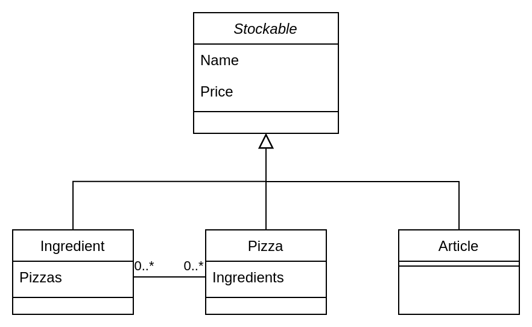
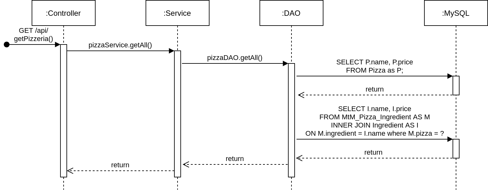

# Qu'est-ce que JEE ?

[question-JEE-1]: <> (Qu'est-ce que JEE ?)
[question-JEE-2]: <> (Quelle est la version actuelle de JEE ?)
[question-JEE-3]: <> (Qui gère JEE ?)
[question-JEE-4]: <> (Connaissez vous des produits basés sur JEE ? Serveurs ?)
[question-JEE-5]: <> (Où est-ce qu'on utilise JEE ?)
[question-JEE-6]: <> (Donnez moi des exemples de specifications)
[question-JEE-7]: <> (Donnez moi des exemples d'implementations)

---

## Qu'est-ce que JEE ?

### Histoire de JEE

- Création en 1999 sous Java 1.2
- Version actuelle Jakarta EE 10
- Ensemble de Java Specification Requests ou JSR
  - JTA (Java Transaction API)
  - JDBC (Java DataBase Connection)
  - JPA (Java Persistence API)
  - Servlet
  - JSP (JavaServer Pages)
  - EJB (Enterprise Java Bean)
- Cédé à Eclipse Foundation en septembre 2017

----

## Qu'est-ce que JEE ?

### Plusieurs type de serveur {.example}
- Serveur d'application (Glassfish, WildFly...)
- Conteneur de servlets (Tomcat, Jetty, WebSphere...)

### Implémentation des spécifications {.alert}
- Spring Framwork et ses modules
  - Spring JDBC (implémente JDBC)
  - Spring ORM (binding hibernate et JPA)
  - Spring Web et WebMVC (implémentent servlet)
- Hibernate ORM (JPA)

----

## JEE (Démo)

## JEE (Démo){.standout}

\centering\Huge\href{http://127.0.0.10:10000/}{Démo}

[question-JEE-8]: <> (Finalement, qu'est-ce qu'une JSP ?)
[à montrer-JEE-1]: <> (pizzeria-servlet WebApp: sources Java)
[à montrer-JEE-2]: <> (pizzeria-servlet resources: configuration des beans spring)
[à montrer-JEE-3]: <> (pizzeria-servlet WEB-INF: configuration de la servlet)
[à montrer-JEE-4]: <> (pizzeria-servlet views: JSP pour la vue)
[à montrer-JEE-5]: <> (Comment on met en production)

# Pourquoi Hibernate ?

[question-Hibernate-1]: <> (Qu'est-ce que hibernate ?)
[question-Hibernate-2]: <> (Qu'est-ce qu'un ORM ?)
[question-Hibernate-3]: <> (Est-ce que Hibernate implémente JEE ?)
[question-Hibernate-4]: <> (Que fait Hibernate en vrai ?)

----

## Que fait Hibernate ?

### Object-Relational Mapping (ORM)
- Classe Java $\Leftrightarrow$ Table SQL (Entity)
- Transactions (JTA)
- Création des tables au démarrage
- Lazy loading
- Gestion des sessions à la DB
- Cache de requêtes

## Hibernate (Démo)

## Hibernate{.standout}

\centering\Huge\href{http://127.0.0.1:8080/pizzas/?type=lazy}{Démo}

[à montrer-Hibernate-1]: <> (pizzeria-core model: Pizza avec ses annotations)
[à montrer-Hibernate-2]: <> (Suppression de la transaction fonctionne toujours depuis 2022)
[à montrer-Hibernate-3]: <> (Différence entre lazy et eagger)
[à montrer-Hibernate-4]: <> (Les requêtes effectuées dans les logs entre lazy et eagger)
[à montrer-Hibernate-5]: <> (pizzeria-core persistence: Différence entre Hibernate et JDBC (DAO))
[à montrer-Hibernate-6]: <> (perf: Différence entre Hibernate et JDBC avec wrk
Lazy Loading: 698.87 Requests/sec
wrk -t 4 -c 50 http://127.0.0.10:10002/pizzas/?type=lazy
JDBC: 3784.49 Requests/sec
wrk -t 4 -c 50 http://127.0.0.10:10002/pizzas/?type=custom
)

## Avantages et Inconvéniants

### Avantages {.example}
- Mapping des classes automatique
- Rapidité d'implémentation
- Génère les requêtes SQL
- Changement facile de SGBD

### Inconvéniants {.alert}
\pause
- Requêtes complexes pas toujours optimisées
- \danger Les relations One/Many To Many en mode lazzy sue certaines versions

# Pourquoi Spring ?

[question-Spring-1]: <> (Qu'est-ce que Spring ?)
[question-Spring-2]: <> (Qu'est-ce qu'un Framework ?)
[question-Spring-3]: <> (À quoi sert Spring ?)
[question-Spring-4]: <> (Est-ce que  Spring implemente JEE ?)
[question-Spring-5]: <> (Qu'est-ce que l'inversion de contrôle ?)
[question-Spring-6]: <> (Qu'est-ce que la programmation orientée aspect ?)

----

## Que fait Spring ?

### L'inversion de contrôle (IOC)
- Résolution des dépendances pour la création des beans (Singleton/Prototype)
- Injection des dépendances

### Programmation orientée aspect (AOP)
- Transactions
- Exception handler
- Intercepteurs (ex: securité)

## Spring Framework{.standout}

\centering\Huge\href{https://joxit.dev/IG-Master2/pizzeria/pizzeria-ui/?url=http://127.0.0.10:10000}{Démo}

[à montrer-Spring-1]: <> (pizzeria-servlet webservice: Configuration d'une API)
[à montrer-Spring-2]: <> (pizzeria-servlet webservice: gestion des erreurs)
[à montrer-Spring-3]: <> (pizzeria-servlet webservice: cohabite avec les webapp sans problème)

# Spring vs Spring Boot ?

[question-SpringBoot-1]: <> (Qu'est-ce que Spring Boot ?)
[question-SpringBoot-2]: <> (Quelles sont les differences entre Spring et Spring Boot ?)

----

## Spring Boot Autoconfigure

### Autoconfiguration{.example}
- Chargement de configuration par défaut
- Chaque module Spring apporte sa configuration

### Charger une configuration

1. Configuration ligne de commande ex: `--server.port=9000`
2. Configuration venant de `SPRING_APPLICATION_JSON` (inline JSON) ex: `{"server":{"port": 9000}}`
3. Java System Properties ex `java -Dserver.port=9000 ...`
4. Variable d'environnement OS ex: `SERVER_PORT=9000`
5. Fichiers `application.properties` ou `application.yaml` dans le dossier `/config` ou à côté du jar ou dans le classpath
6. Les valeurs par défaut de configuration (dans le code)

## Spring Framework vs Spring Boot ?

### Spring Boot{.example}
- Basé sur Spring Framwork
- Configuration automatique de l'application
- Tomcat intégré (serveur légers)
- Beaucoup, beaucoup, beaucoup moins de code
- Produit un fat jar (plus simple à lancer)
- Bien pour faire des microservices scalable

### Spring Framework{.alert}
- Configuration via XML
- Déploiement d'un war (serveur lourd)

## Spring Boot{.standout}

\centering\Huge\href{https://joxit.dev/IG-Master2/pizzeria/pizzeria-ui/?url=http://127.0.0.10:10002}{Démo}

[question-SpringBoot-3]: <> (Que choisir entre Spring sur Tomcat et Spring Boot ?)
[question-SpringBoot-4]: <> (Quelles sont les differences entre Spring et Spring Boot ?)
[question-SpringBoot-5]: <> (Niveau perf un changement ?)
[à montrer-SpringBoot-1]: <> (pizzeria-boot webservice: Anotations similaires à Spring Framework)
[à montrer-SpringBoot-2]: <> (pizzeria-boot resources: La configuration)

# Qu'est-ce que ~~Maven~~ Gradle ?

[question-Gradle-1]: <> (Qu'est-ce que Gradle ?)
[question-Gradle-2]: <> (Qu'est-ce qu'un gestionnaire de build/dépendences ?)
[question-Gradle-3]: <> (Connaissez vous d'autres gestionnaires de build/dépendences ?)

----

## Qu'est-ce que ~~Maven~~ Gradle ?

### Gradle {.example}
- Gestionnaire de build et de dépendances évolué
- Utilisation du multi-module
- Lancement des tests
- Plugins en tout genre
- Sans installation grâce au wrapper (également disponible dans Maven 3.7+)
- Moins verbeux que Maven (Groovy/Kotlin vs XML)

## Gradle{.standout}

\centering\Huge\href{https://github.com/Joxit/IG-Master2/commit/a77b03c0496a31a3fabbcf9d873f45bc909ac9a2}{Démo}

# Reactive Programming ?

[question-Reactive-1]: <> (Qu'est-ce que la programmation réactive ?)
[question-Reactive-2]: <> (Où est-ce que c'est le plus souvent utilisé ?)
[question-Reactive-3]: <> (Quel est la différence entre la programmation réactive et impérative ?)

----

## Reactive Programming

### Modèle classique {.alert}
- 1 requête = 1 thread
- 10 requêtes = 10 threads
- 100 requêtes = 100 threads
- Mais combien d’opérations peuvent réellement être exécutées en même temps?

### Modèle réactif {.example}
- Des requêtes sur des \say{workers}
- Optimiser l’activité du thread plutôt que le nombre de threads
- Opérations non blocantes

## Reactive Programming Démo{.standout}

\centering\Large

Spring Framework + Servlet

vs

Spring Boot Web MVC

vs

Spring Boot Weblfux (Réactive)

[à montrer-Reactive-1]: <> (pizzeria-webflux: Application pour les anotation et webservice)
[à montrer-Reactive-2]: <> (pizzeria-webflux: Sur des requêtes utilisant la BDD cela ne va rien changer (dangeureux même))
[à montrer-Reactive-3]: <> (perf: entre spring boot et webflux sur empty
Servlet: 11882.75 Requests/sec
wrk -t 4 -c 50 http://127.0.0.10:10000/pizzas/?type=empty
Spring Boot: 12885.37 Requests/sec
wrk -t 4 -c 50 http://127.0.0.10:10002/pizzas/?type=empty
Spring Webflux: 13591.05 Requests/sec
wrk -t 4 -c 50 http://127.0.0.10:10003/pizzas/?type=empty
)

# Et pour après ?

----

## Autres frameworks ?

### Alternatives à JEE
- Vert.x (framework événementiel par la fondation Eclipse)
- Netty (framework non-blocking I/O par Netty Project Community)
- Quarkus + GraalVM
- Ktor (framwork asynchrone designé pour Kotlin)

## Vert.x Démo{.standout}

\centering\Large

Spring Boot Weblux

vs

Vert.x

[à montrer-Vert.x-1]: <> (perf: entre vertx et webflux sur empty et temps de démarrage
Spring Webflux: 13591.05 Requests/sec
wrk -t 4 -c 50 http://127.0.0.10:10003/pizzas/?type=empty
Spring Vert.x: 15602.93 Requests/sec
wrk -t 4 -c 50 http://127.0.0.10:10001/pizzas/?type=empty
)
[à montrer-Vert.x-2]: <> (Difference entre Netty et Vert.x)

## Introduction à Spring et Hibernate{.standout}

\centering\Huge Questions ?
