# Sujet: La cartographie avec OpenStreetMap

Dans ce projet, nous allons créer et utiliser des services autour de la cartographie digitale. Pour commencer, on va à la base de ces services : la carte.

Comme vous avez pu le voir pendant le cours, il n'est pas simple de gérer la donnée OSM, c'est pour cela qu'on n'ira pas jusqu'à posséder une base OSM. À la place, nous allons utiliser un SVG du monde qui sera tuilé. J'ai déjà créé le service de tuilage, vous n'aurez qu'à appeler cette méthode.

La première partie consiste à créer son serveur de tuiles. Il n'y aura pas de partie front lors de ce TP!

## Prérequis

Pour commencer vous devez déjà avoir [IntelliJ Idea Community ou Ultimate](https://www.jetbrains.com/idea/download/#section=linux) d'installé avec Java.
Vous pouvez utiliser d'autres IDE, mais je ne pourrais pas vous aider... (Non, Atom n'est pas un IDE...)

### Récuperer le code

Le rendu sera sous forme de lien sur le gitlab de la fac. Je **veux l'historique git complet** pour vous corriger facilement (vous aurez droit à des malus si ce n'est pas le cas), pour cela je vous conseille de suivre les instructions suivantes.

Allez sur le gitlab de l'USPN, cliquez sur `New Project` 

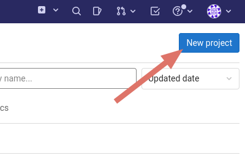
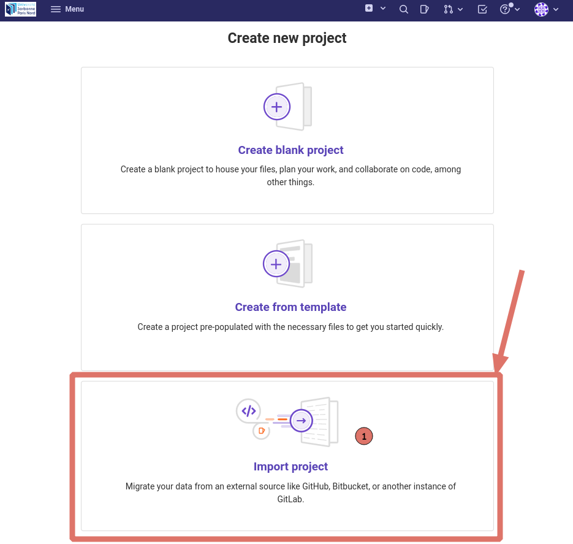

Ensuite, importer depuis une url qui sera `https://github.com/Joxit/IG-Master2` (c'est ce qui permet d'avoir tout l'historique). Remplissez les champs comme ci-dessous. Il doit bien être dans votre espace avec votre nom/numéro étudiant.

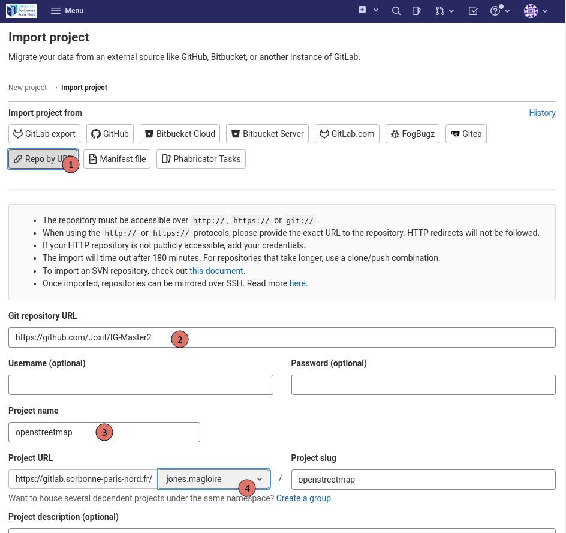
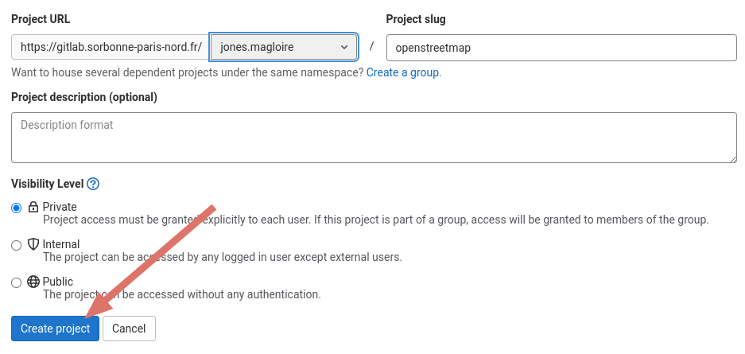

Vous pourrez ensuite clone votre projet avec la manière que vous voulez (avec ou sans clé SSH... Via IntelliJ ou ligne de commande...)

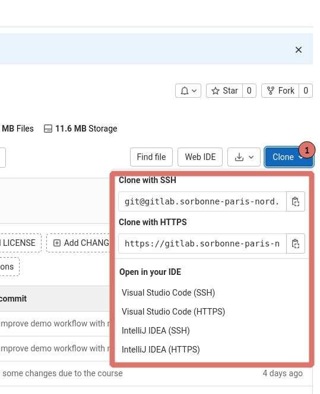

Pour finir vous devez m'ajouter en tant que développeur pour que je puisse commenter vos commits et voir votre code.

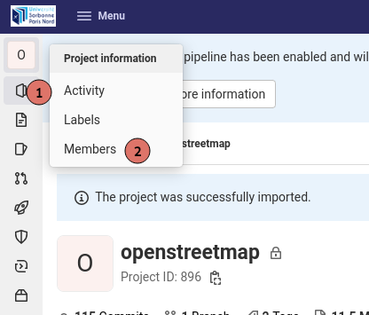
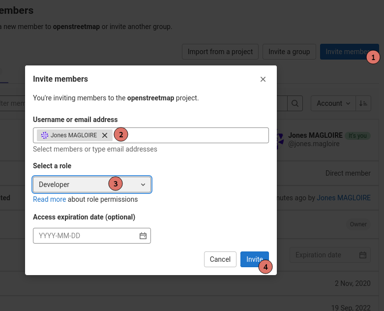

### Configurer IntelliJ

Si vous vous vous êtes déjà servis de IntelliJ, cliquez sur `File` -> `New` -> `Project From Existing Sources`.

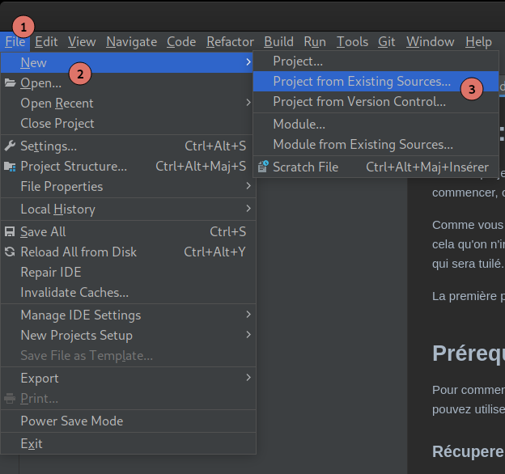

Sinon, sur la page de `Welcome to IntelliJ IDEA`, cliquez sur `Open`

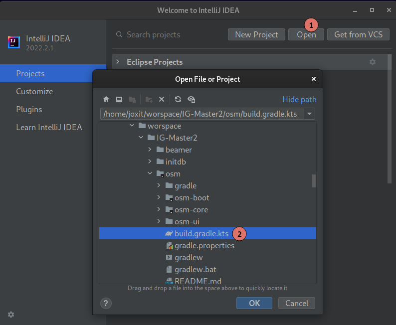

Dans les deux cas, cela ouvre une fenêtre, naviguez jusqu'au projet et **sélectionnez le fichier** `osm/build.gradle.kts` et ouvrez en tant que projet.
Cela ouvre une fenêtre avec le projet configuré avec Gradle.

Si vous n'avez pas Java de configuré, vous pouvez sélectionner le SDK à utiliser, pour cela cliquez sur `File` -> `Project Structure` -> `Project`. Vous verrez peut-être que vous verrez `<No SDK>`, cliquez dessus et sélectionnez une version de Java (s'il y en a une supérieure ou équivalente à 17), sinon deux choix s'offrent à vous:

1. Vous avez déjà un SDK sur votre machine alors faites : `Add SDK` -> `JDK`. Cela ouvre une fenêtre, naviguez jusqu'à l'endroit où il y a votre JDK (essayez `/usr/lib/jvm/` pour linux ou dans les dossiers `Program Files/Eclipse Foundation` sous Windows).
2. Vous n'avez pas de SDK sur votre machine, alors faites : `Download JDK` -> `Eclipse Temurin` -> La dernière version disponible.

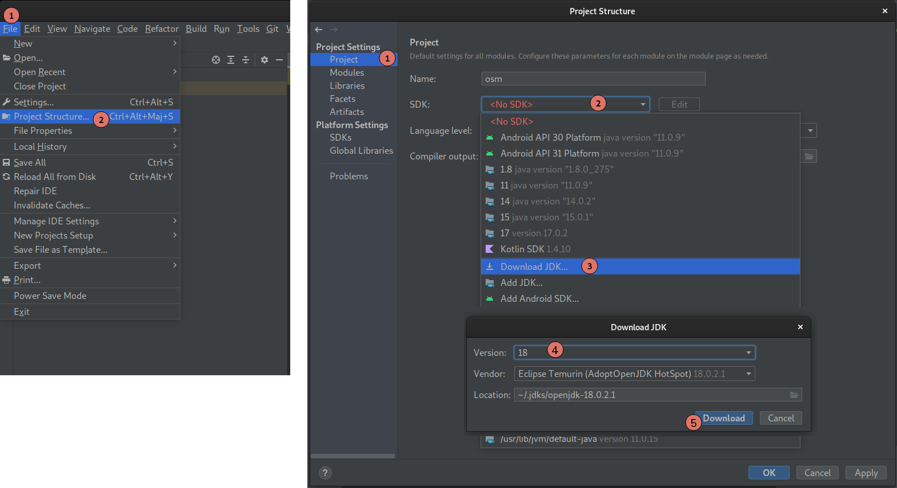

Vérifiez que le SDK utilisé par le projet est le même que celui qu'utilisera gradle. Pour cela allez dans `File` -> `Settings`. Cela ouvre une nouvelle fenêtre, sur la gauche sélectionnez `Build, Execution, Deployment` -> `Build Tool` -> `Gradle` et sélectionnez une version de JVM identique à celui du projet (vérifiez que c'est positionné sur `Project SDK`).

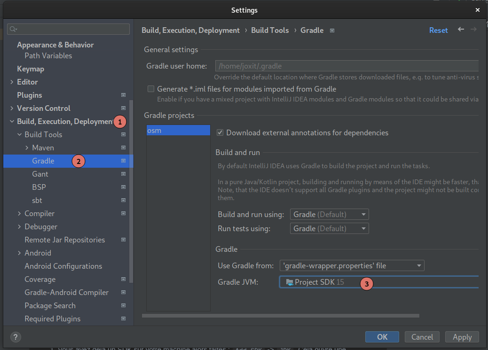

Pour vérifier que tout fonctionne correctement, vous pouvez lancer le projet, sur la partie de gauche (Projet), ouvrez le projet `osm` -> `osm-boot` -> `src` -> `main` -> `kotlin` -> `io.github.joxit.osm`. Faites un clique droit sur Application puis `Run Application.main()`.

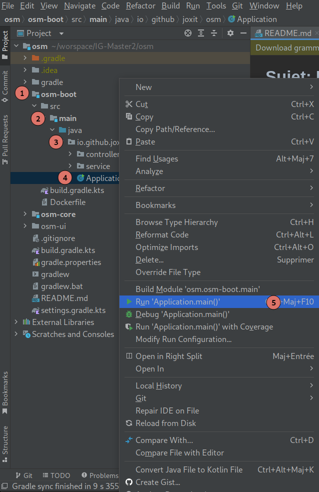

Dès que vous avez dans la console quelque chose ressemblant à cela, c'est que votre serveur est démarré. Un [serveur](https://fr.wikipedia.org/wiki/Serveur_informatique) fournit donc des services à un ou plusieurs clients. Pour ce faire il doit rester démarré sans s'arrêter...
:warning: Donc **si vous voyez que ça ne bouge pas c'est totalement normal**... Il fait déjà son travail !

```
  .   ____          _            __ _ _
 /\\ / ___'_ __ _ _(_)_ __  __ _ \ \ \ \
( ( )\___ | '_ | '_| | '_ \/ _` | \ \ \ \
 \\/  ___)| |_)| | | | | || (_| |  ) ) ) )
  '  |____| .__|_| |_|_| |_\__, | / / / /
 =========|_|==============|___/=/_/_/_/
 :: Spring Boot ::        (v2.3.4.RELEASE)

2020-11-02 07:11:55.234  INFO 8 --- [           main] io.github.joxit.osm.Application          : Starting Application v1.0-SNAPSHOT on 333bac29f1ba with PID 8 (/usr/src/osm/osm-boot.jar started by root in /usr/src/osm)
2020-11-02 07:11:55.243  INFO 8 --- [           main] io.github.joxit.osm.Application          : No active profile set, falling back to default profiles: default
2020-11-02 07:11:55.385  WARN 8 --- [kground-preinit] o.s.h.c.j.Jackson2ObjectMapperBuilder    : For Jackson Kotlin classes support please add "com.fasterxml.jackson.module:jackson-module-kotlin" to the classpath
2020-11-02 07:11:56.844  INFO 8 --- [           main] o.s.b.w.embedded.tomcat.TomcatWebServer  : Tomcat initialized with port(s): 8080 (http)
2020-11-02 07:11:56.863  INFO 8 --- [           main] o.apache.catalina.core.StandardService   : Starting service [Tomcat]
2020-11-02 07:11:56.863  INFO 8 --- [           main] org.apache.catalina.core.StandardEngine  : Starting Servlet engine: [Apache Tomcat/9.0.38]
2020-11-02 07:11:56.955  INFO 8 --- [           main] o.a.c.c.C.[Tomcat].[localhost].[/]       : Initializing Spring embedded WebApplicationContext
2020-11-02 07:11:56.955  INFO 8 --- [           main] w.s.c.ServletWebServerApplicationContext : Root WebApplicationContext: initialization completed in 1557 ms
2020-11-02 07:11:57.623  INFO 8 --- [           main] o.s.b.w.embedded.tomcat.TomcatWebServer  : Tomcat started on port(s): 8080 (http) with context path ''
2020-11-02 07:11:57.639  INFO 8 --- [           main] io.github.joxit.osm.Application          : Started Application in 3.349 seconds (JVM running for 4.319)
2020-11-02 07:13:35.754  INFO 8 --- [nio-8080-exec-1] o.a.c.c.C.[Tomcat].[localhost].[/]       : Initializing Spring DispatcherServlet 'dispatcherServlet'
2020-11-02 07:13:35.754  INFO 8 --- [nio-8080-exec-1] o.s.web.servlet.DispatcherServlet        : Initializing Servlet 'dispatcherServlet'
2020-11-02 07:13:35.769  INFO 8 --- [nio-8080-exec-1] o.s.web.servlet.DispatcherServlet        : Completed initialization in 15 ms
```

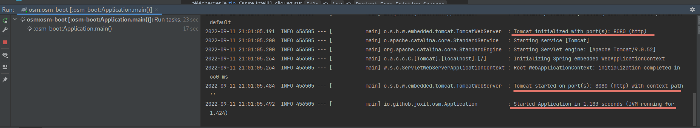

Vous pourrez contacter le serveur sur le port 8080. Si vous essayez d'aller sur <http://localhost:8080/>, vous allez voir une page avec écrit `Whitelabel Error Page`, c'est que le serveur répond, vous pouvez commencer à coder! Pour le moment si vous voulez voir la carte, cela ne marchera pas, car vous n'avez pas encore dit à votre serveur de renvoyer les morceaux de tuile !

## Sujet du TP

Pour réussir le TP, vous devez lire correctement le sujet et suivre les étapes.
Tout est mentionné, pour la partie nominale (hors bonus) **VOUS N'AVEZ PAS DE FICHIER À CRÉER !** Tout a déjà été préparé !
Si vous n'utilisez pas l'arborescence et les fichiers donnés, vous perdrez des points !

### Le serveur de tuiles

Pour le serveur, nous allons utiliser Spring Boot, la base de code est disponible dans `osm-boot`. Voici quelques étapes que vous pouvez suivre pour vous aider.

1. **Utilisez la classe** `TileRepository`:
   1. Transformez la en un Repository spring qui pourra être injecté plus tard.
   2. Faites en sorte que le fichier `world.svg` soit injecté dans l'attribut `worldSVG` déjà en paramètre du constructeur.
2. **Utilisez la classe** `TileService`:
   1. Transformez la en un Service spring qui pourra être injecté plus tard.
   2. Faites en sorte d'injecter une instance de `TileRepository` dans votre service grâce à l'injection de dépendances de Spring.
   3. Utilisez la fonction `generateTile` du Repository dans votre Service.
3. **Utilisez la classe** `TileController`:
   1. Transformez la en un Controlleur REST spring qui pourra répondre aux requêtes, comme vu en cours.
   2. Assurez-vous d'avoir également la configuration pour le Cross Origins.
   3. La fonction getTile devra répondre aux requêtes GET `/{z}/{x}/{y}.png` et devra renvoyer un header `image/png`.
4. Retournez dans `TileService` et faites de la validation des tuiles dans votre Service. Vous devrez throw une exception de type `IllegalArgumentException` quand les nombres sont négatifs, quand les valeurs de x et y trop grands par rapport au niveau de zoom et z ne doit pas dépasser 24.
5. **Utilisez la classe** `GlobalExceptionHandler`:
   1. Elle doit pouvoir gérer les exceptions que vous avez créés dans la question précédente.
   2. Vous devrez renvoyer un code d'erreur 400 avec le texte de votre validation.
6. **Bonus**: Utilisez un cache pour ne pas à avoir à générer les tuiles à chaque fois.
7. **Bonus**: Améliorez le code de la classe `TileRepository` pour améliorer les perfs. Hint: Attention à l'Input-Output ;).
8. Démarrez votre serveur de tuiles. Il écoutera sur le port 8080, <http://127.0.0.1:8080/0/0/0.png> devrait afficher la carte du monde.

Maintenant vous avez toutes les fonctionnalités de base d'un serveur de tuiles.

### Afficher une carte

Tout a déjà été fait, vous pouvez utiliser le résultat [ici](https://joxit.dev/IG-Master2/osm/osm-ui/?url=http://127.0.0.1:8080). Le query parameter `url=http://127.0.0.1:8080` vous permet de configurer votre serveur de tuile dans l'éventualité qu'il soit sur un autre port.

Pour information, si vous souhaitez afficher des cartes sur un site web, vous devrez utiliser des librairies comme [MapLibre GL](https://maplibre.org/), ou [Leaflet](https://leafletjs.com/). Le choix du service de cartographie est libre (il faudra bien entendu préférer [Jawg Maps](https://www.jawg.io)).

### Ajouter des points

Maintenant nous allons ajouter des points à la carte. Nous avons à disposition la liste des préfectures de France au format GeoJSON. Le but sera de renvoyer cette liste via notre API de tuiles.

1. **Utilisez la classe** `TileService`:
   1. Faites en sorte que le GeoJSON `prefectures.geojson` des ressources, soit accessible dans votre service.
   2. Utilisez `@Value` de Spring.
   3. Attention [la méthode `getFile` ou l'objet `File`](https://stackoverflow.com/questions/14876836/file-inside-jar-is-not-visible-for-spring) sont à proscrire quand on utilise des fichiers dans le classpath.
2. **Utilisez la classe** `TileController`:
   1. La fonction getPrefectures devra répondre aux requêtes GET `/prefectures.geojson` et devra renvoyer un header `application/json`.
   2. Utilisez votre service pour renvoyer les préfectures.
3. **Bonus**: Utilisez un cache mémoire pour ne pas à ouvrir le fichier à chaque fois.

## Annexes

### Les annotations Spring

- `@Autowired`: Marque un constructeur, un champ, une méthode setter ou une méthode de configuration comme devant être injecté automatiquement par le système d'injection de dépendances de Spring.
- `@ControllerAdvice`: Marque une classe qui pourra gérer les exceptions de votre application. Les méthodes annotés avec `@ExceptionHandler` seront executés.
- `@CrossOrigin`: Annotation permettant d'autoriser les requêtes CORS (erreurs au niveau des navigateurs web) sur des controlleurs
- `@ExceptionHandler`: Indique quelle exception doit être gérée via la méthode en question.
- `@GetMapping`: Spécialisation de `RequestMapping` pour des requêtes GET.
- `@PathVariable`: Indique que le paramètre d'une méthode devrait être liée à une variable template de l'URI. Supporté par les méthodes utilisant les annotations de type RequestMapping.
- `@Repository`: Indique qu'une classe annotée est un "Repository". Cette annotation permet à ses implémentations d'être auto détectée à travers un scan du classpath par Spring.
- `@RequestMapping`: Annotation pour mapper les requêtes web sur des méthodes dans des controlleurs.
- `@RestController`: Indique qu'une classe annotée est un "Controller REST". Cette annotation permet à ses implémentations d'être auto détectée à travers un scan du classpath par Spring.
- `@Service`: Indique qu'une classe annotée est un "Service". Cette annotation permet à ses implémentations d'être auto détectée à travers un scan du classpath par Spring.
- `@Value`: Permet d'injecter dans une variable une valeur, une ressource ou une propriété

### Les classes Java et Spring

- `InputStream`: Flux de donnée d'un fichier. Peut être lu une fois pour renvoyer des bytes ou un String.
- `MediaType`: Vous permet d'acceder aux headers souvent utilisés comme `IMAGE_PNG_VALUE` ou `APPLICATION_JSON_VALUE`.
- `Resource`: Permet d'injecter des resources du classpath.
